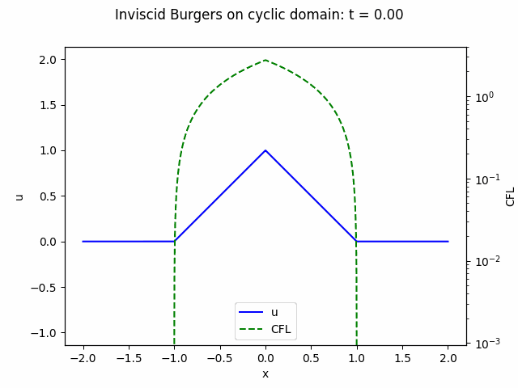

# burgers

Solution of the inviscid [Burgers equation](https://en.wikipedia.org/wiki/Burgers%27_equation) on a cyclic domain using finite volumes with a minmod slope limiter and the Riemann solver presented [here](https://zingale.github.io/comp_astro_tutorial/advection_euler/burgers/burgers-methods.html).



To run:

```bash
git clone https://github.com/jonpea/burgers.git
cd burgers/
poetry install
poetry shell
python3 burgers.py
xdg-open burgers.gif
```
